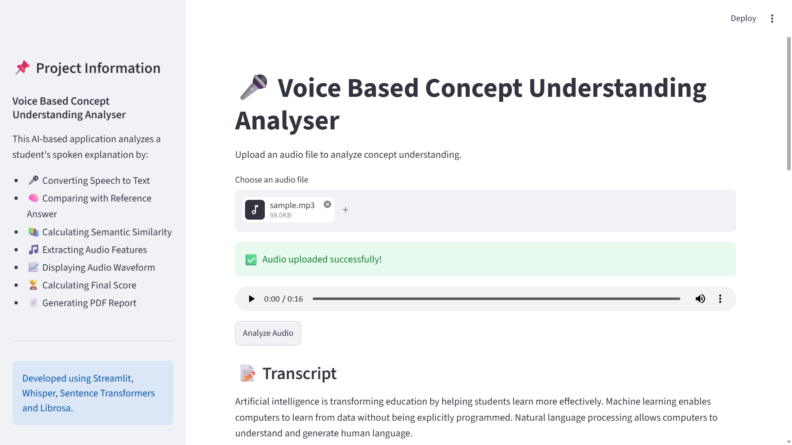
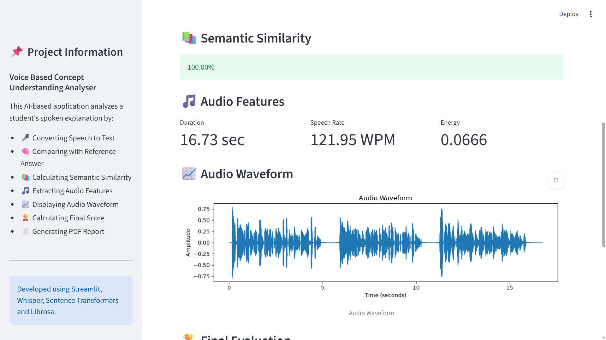
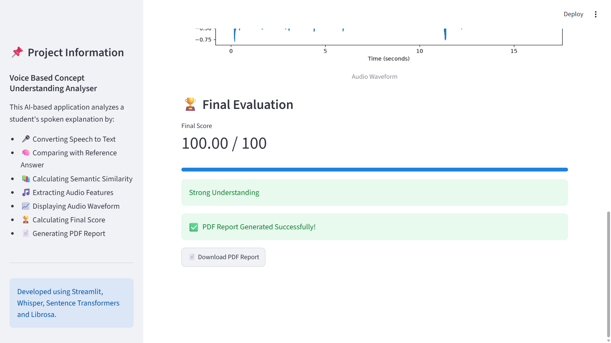

# 🎤 Voice Based Concept Understanding Analyser

## 📖 Project Description

The **Voice Based Concept Understanding Analyser** is an AI-powered application that evaluates a student's spoken explanation of a concept. It converts speech into text, compares it with a reference answer using semantic similarity, analyzes audio features, calculates an understanding score, and generates a PDF report.

---

## ✨ Features

- 🎤 Speech-to-Text using OpenAI Whisper
- 🧠 Semantic Similarity using Sentence Transformers
- 🎵 Audio Feature Extraction
  - Duration
  - Speech Rate
  - Audio Energy
- 📈 Audio Waveform Visualization
- 🏆 Automatic Understanding Score
- 📄 PDF Report Generation
- 🌐 Interactive Streamlit Web Interface

---

## 🛠 Technologies Used

- Python
- Streamlit
- OpenAI Whisper
- Sentence Transformers
- PyTorch
- Librosa
- NumPy
- Matplotlib
- ReportLab

---

## 📂 Project Structure

```
Voice-Based-Concept-Understanding-Analyser/
│
├── app.py
├── requirements.txt
├── README.md
├── .gitignore
│
├── modules/
│   ├── speech_to_text.py
│   ├── semantic_analysis.py
│   ├── audio_features.py
│   ├── scoring.py
│   └── pdf_report.py
│
├── tests/
│   ├── test_whisper.py
│   ├── test_semantic.py
│   ├── test_audio_features.py
│   └── test_scoring.py
│
├── audio/
│
├── assets/
│
└── reports/
```

---

## ⚙ Installation

### 1. Clone the Repository

```bash
git https://github.com/Swethamadda0710/Voice-Based-Concept-Understanding-Analyser.git
cd Voice-Based-Concept-Understanding-Analyser
```

---

### 2. Create Virtual Environment

```bash
python -m venv .venv
```

---

### 3. Activate Virtual Environment

Windows PowerShell

```bash
.venv\Scripts\Activate.ps1
```

Windows CMD

```bash
.venv\Scripts\activate
```

---

### 4. Install Required Packages

```bash
pip install -r requirements.txt
```

---

### 5. Install FFmpeg

Download FFmpeg and add it to your system PATH.

Verify installation:

```bash
ffmpeg -version
```

---

### 6. Run the Project

```bash
streamlit run app.py
```

The application will open in your browser.

---

## 📄 Generated Report

The application generates a PDF report containing:

- Transcript
- Semantic Similarity
- Audio Features
- Final Score
- Feedback

Reports are stored inside the **reports/** folder.

---

## 📸 Sample Output

-
-
-

---

## 👩‍💻 Team Members

- Swetha Madda
- Pechetti Harshini
- Yogeswari Vasantala
- Shiva Shankar Yellaboyina
- Syed Mohammad Saad
---

## 📜 License

This project is developed for educational purposes.
