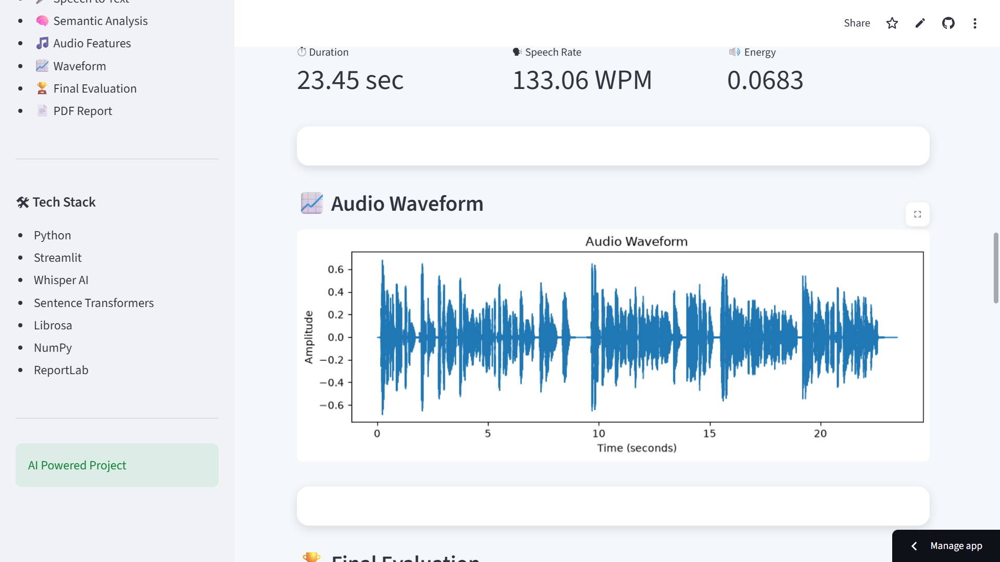
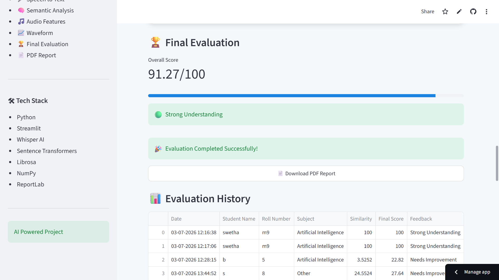
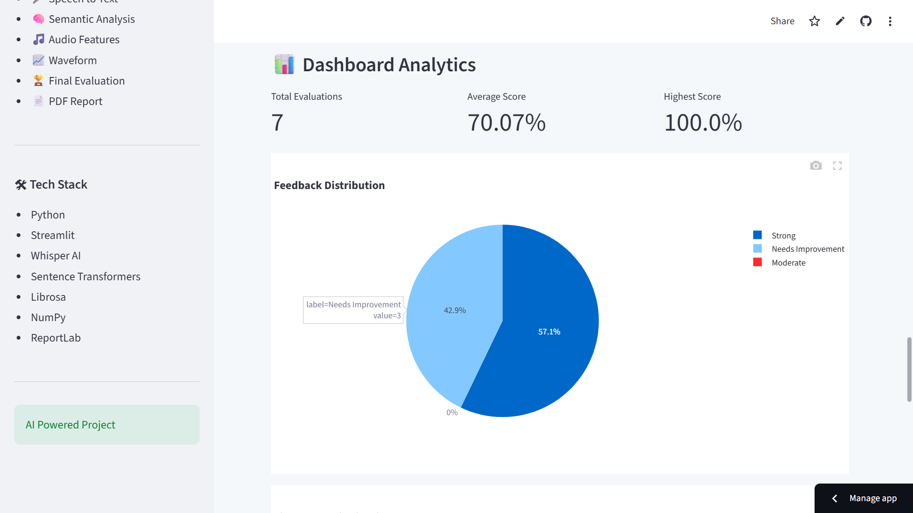
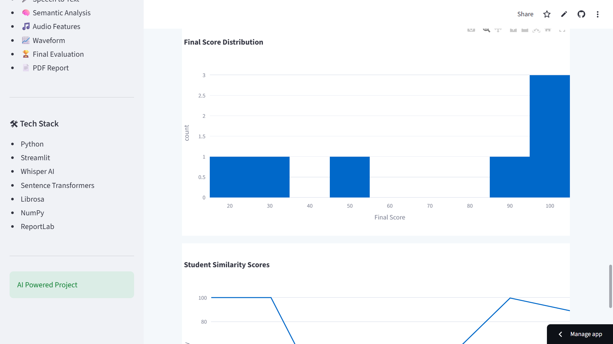
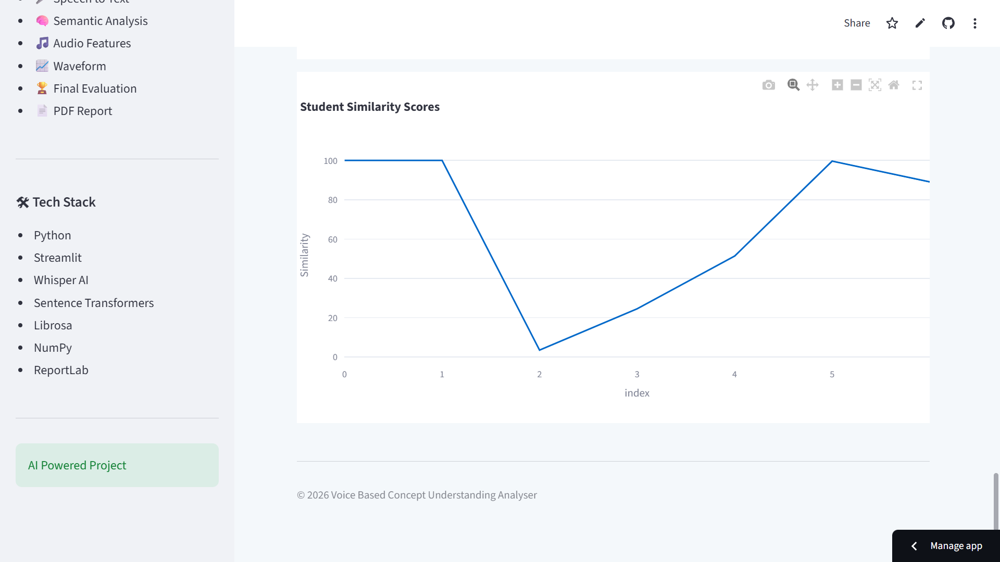
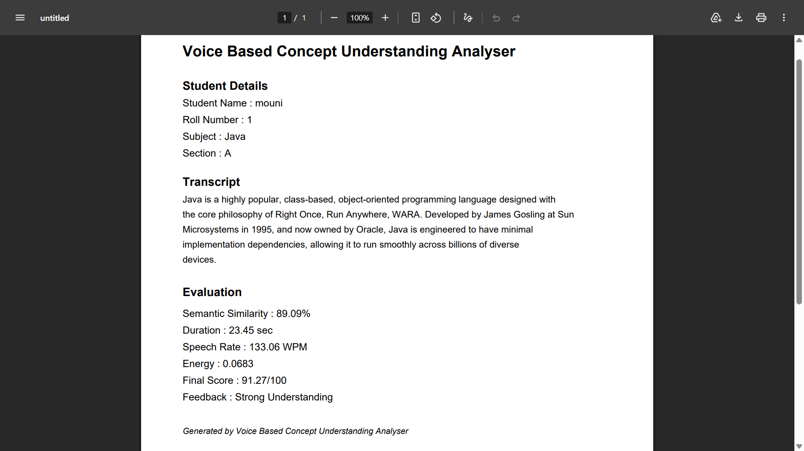

# 🎤 Voice Based Concept Understanding Analyser

An AI-powered web application that evaluates a student's spoken explanation of a concept using **Speech-to-Text**, **Natural Language Processing (NLP)**, and **Audio Feature Analysis**.

---

## 🚀 Project Status

✅ Completed

🌐 Successfully Deployed on Streamlit Cloud

---

## 🌐 Live Demo

🔗 **Streamlit App:**  
https://voice-based-concept-understanding-analyser-5h8yakbhdlpv4tu2hb5.streamlit.app/

---

## 💻 GitHub Repository

🔗 **GitHub:**  
https://github.com/Swethamadda0710/Voice-Based-Concept-Understanding-Analyser

---

## 📖 Project Description

The **Voice Based Concept Understanding Analyser** helps evaluate a student's conceptual understanding by analyzing their spoken explanation.

The application performs the following tasks:

- Converts speech into text using **OpenAI Whisper**
- Compares the student's answer with the teacher's reference answer using **Sentence Transformers**
- Extracts important audio features
- Calculates an overall understanding score
- Generates a professional PDF report
- Displays evaluation history and dashboard analytics

---

## 🎯 Objectives

- Evaluate students' spoken explanations using AI.
- Convert speech into text accurately.
- Compare student answers with a reference answer.
- Calculate semantic similarity.
- Extract speech-related audio features.
- Generate an AI-based evaluation score.
- Produce downloadable PDF reports.
- Maintain evaluation history and analytics.

---

# ✨ Features

- 🎤 Speech-to-Text (OpenAI Whisper)
- 🧠 Semantic Similarity Analysis
- 🎵 Audio Feature Extraction
  - Duration
  - Speech Rate
  - Energy
- 📈 Audio Waveform Visualization
- 🏆 AI-based Evaluation Score
- 📄 PDF Report Generation
- 📊 Evaluation History
- 📈 Dashboard Analytics
- 🎙 Voice Recording Support
- 🌐 Interactive Streamlit Web Application

---

# 🛠 Technologies Used

- Python
- Streamlit
- OpenAI Whisper
- Sentence Transformers
- PyTorch
- Librosa
- NumPy
- Pandas
- Plotly
- Matplotlib
- ReportLab

---

# 📂 Project Structure

```text
Voice-Based-Concept-Understanding-Analyser/
│
├── app.py
├── requirements.txt
├── packages.txt
├── README.md
├── .gitignore
│
├── modules/
│   ├── speech_to_text.py
│   ├── semantic_analysis.py
│   ├── audio_features.py
│   ├── scoring.py
│   ├── pdf_report.py
│   ├── history.py
│   └── dashboard.py
│
├── assets/
│   └── screenshots/
│
├── audio/
├── reports/
├── data/
│   └── results.csv
│
└── tests/
```

---

# ⚙ Installation

## 1️⃣ Clone the Repository

```bash
git clone https://github.com/Swethamadda0710/Voice-Based-Concept-Understanding-Analyser.git
cd Voice-Based-Concept-Understanding-Analyser
```

---

## 2️⃣ Create Virtual Environment

```bash
python -m venv .venv
```

---

## 3️⃣ Activate Virtual Environment

### Windows

```bash
.venv\Scripts\activate
```

---

## 4️⃣ Install Dependencies

```bash
pip install -r requirements.txt
```

---

## 5️⃣ Run the Project

```bash
streamlit run app.py
```

The application will automatically open in your browser.

---

# 📄 Generated Report

The application generates a detailed PDF report containing:

- Student Details
- Transcript
- Semantic Similarity
- Audio Features
- Final Evaluation Score
- Feedback

Reports are automatically saved inside the **reports/** folder.

---

# 📸 Sample Output

## Home Page


---

## Student Info & Audio Upload 


---

## Analysis Results




---

## Final Evaluation 









---

## PDF Report



---

# 🚀 Future Enhancements

- Real-time Speech Streaming
- Multi-language Support
- Teacher Login Portal
- Student Login Portal
- Cloud Database Integration
- AI Feedback Suggestions
- Performance Analytics

---

# 👩‍💻 Team Members

- **Swetha Madda**
- **Yogeswari Vasantala**
- **Shiva Shankar Yellaboyina**
- **Syed Mohammad Saad**

---

# 📚 References

- Python – https://www.python.org/
- Streamlit – https://streamlit.io/
- OpenAI Whisper – https://github.com/openai/whisper
- Sentence Transformers – https://www.sbert.net/
- Librosa – https://librosa.org/
- PyTorch – https://pytorch.org/
- ReportLab – https://www.reportlab.com/

---

# 📜 License

This project is developed for educational purposes.

---

# ⭐ Support

If you found this project useful, consider giving it a ⭐ on GitHub.